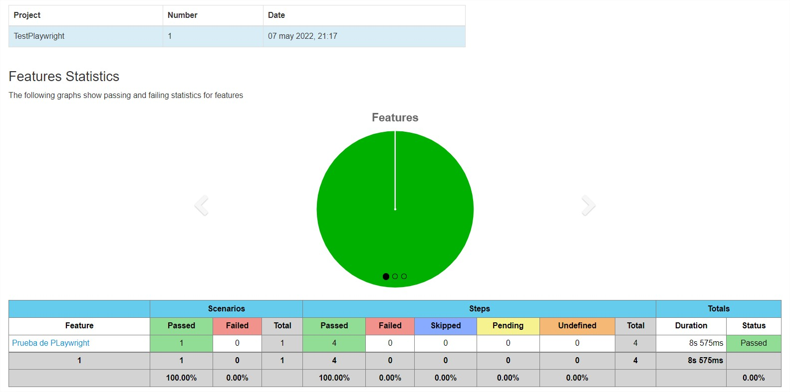

# PLAYWRIGHT JAVA TEMPLATE

this template aims to simplify the process or start with playwright java
since I have integrated cucumber-html-report and created the initial folder structure
and simple integration of screenshots for failing scenarios.
In addition, I added here some comments about how to implement for CI/CD with Jenkins and Docker files.
please, try to replicate it from scratch by your self if you are starter with playwright java since most information is available for Node.js
find more documentation about this incredible tool here: [Playwright-Java](https://playwright.dev/java/docs/intro)

## pre-requisites and How to use
my setup: 
* *Apache Maven* ***3.6.3*** 
* *Java version* ***1.8.0_202***

Clone the Code in your own repo
and modify files according your needs, like features or steps.

## Structure and Files
it is not a formal POM, for instance, I missed including `models` folder,
again, feel free to adapt this template according your needs.
```
src
└── test
│   ├── java                   
│   │   ├── cucumberHooks               
│   │   │   └── Hooks                   # Definition of Cucumber Hooks (official documentation for cucumber.io here: https://cucumber.io/docs/cucumber/api/#hooks)
│   │   ├── driverSetup                 
│   │   │   └── driver                  # settings for the browser. I have not added but you can skip browser download here if needed.
│   │   ├── interfaces                  
│   │   │   └── googleMain              # Interfaces were locators are saved
│   │   ├── Steps                       
│   │   │   └── stepDefinition          # defenition of each step from feature file following cucumber framework and BDD.
│   │   └── CucumberTestRunner          # as part of the framework is the runner file to define order and other settings for the run of the test suite
├── resources
│   ├── features
│   │   └── testGoogle.feature          # feature is the human part of the code were the test is described in human language.
│   └── cucumber.properties             
├── pom.xml
└── README.md
```

## How to run
use following command in terminal for running:
```
mvn clean "-Dtest=CucumberTestRunner" test
```
use following command in terminal for reporting:
```
mvn verify "-DskipTests"
```
if everything was ok, you should see a new folder at **src** level called `target` so going to `target/cucumber-html-report` and open in some browser the file `feature-overview.html`
and this is what you should see:



In addition, you can force the scenario to fail just to see how the screenshot in report works, so uncomment the line 34 of stepDefinition file.
in the report you will find the screenshot as a png image in the After hook.

## CI CD
### Docker
create a dockerfile and copy pom.xml and src folder into the image.
use the official microsoft image for playwright java
I recommend running the test in chromium browser in the docker image.
### Jenkins
create a Jenkins file including the mvn clean command mentioned above.

#### Final Comments
feel free to share any recommendation/observation to the template if you liked.
you can text me in english, spanish or portuguese, therefore, as you can see my mother tongue is Spanish. 
I want to offer something simple as template for my personal purpose and public exposition.